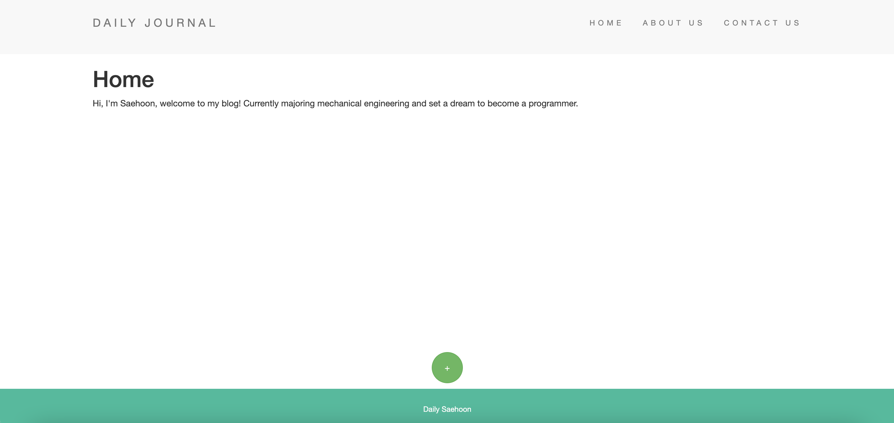
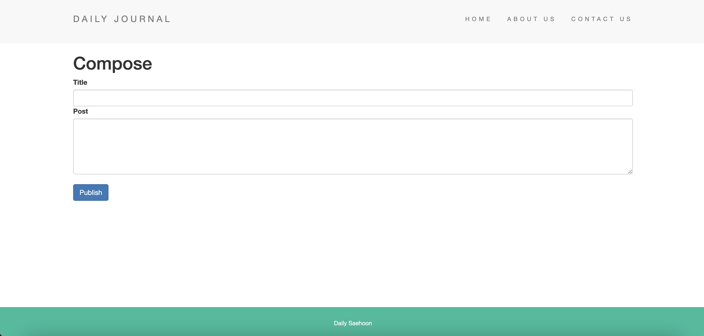
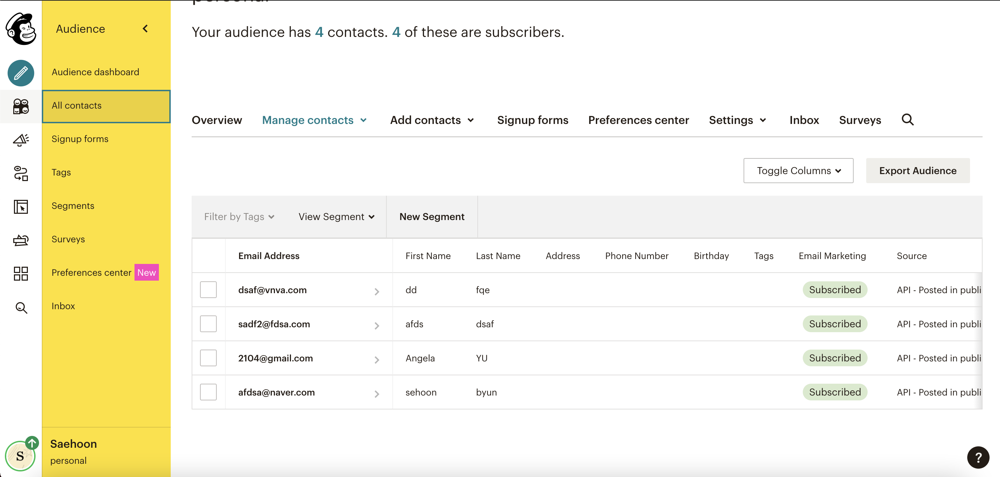

# Webproject        
HTML, CSS, JavaScript, Node.js, Bootstrap, EJS 등 을 사용해 여러 웹 페이지를 구현.          
nodemodule 파일이 없기 때문에 필요할 시, 다운받은 폴더에서 npm install을 실행해서 사용 가능.                        

## BlogSite
Node.js와 EJS를 이용한 나의 Blog 구현.      
           
EJS를 이용해 테플릿으로 추가되는 Post에 따라 그에 맞는 Tag 추가, HTML 추가 등 구현.

/compose 페이지에서 작성된 게시물의 Title과 Post를 Home화면에 추가시킴.         

## Dicee
Javascript를 이용 DOM에 접근해 랜덤 함수를 이용, 주사위 굴리기 게임.        

## Drum Kit
Javasript를 이용 EventListener를 사용해 클릭과 키보드로 드럼 연주 게임.     
    

## Kakao-clone
HTML과 CSS를만을 이용해 카카오톡 UI를 구현.

## NewsLetter-signUp
Node.js를 이용해 이메일 입력 받는 기능 구현.            
mailchimp API를 이용해 실제로 이름과 이메일을 입력 받아 구독자들 관리하기.          
        
이메일 형식에 맞게 자신의 정보를 입력한다.          

        
mailchimp API에 request를 보내 입력한 구독자의 정보를 저장 및 관리할 수 있다.       

## todolist-v1
Node.js와 EJS를 이용해 toDoList 구현.
메인페이지와 /work 페이지로 구성.

## 그림판
Javascript를 이용한 그림판 구현.